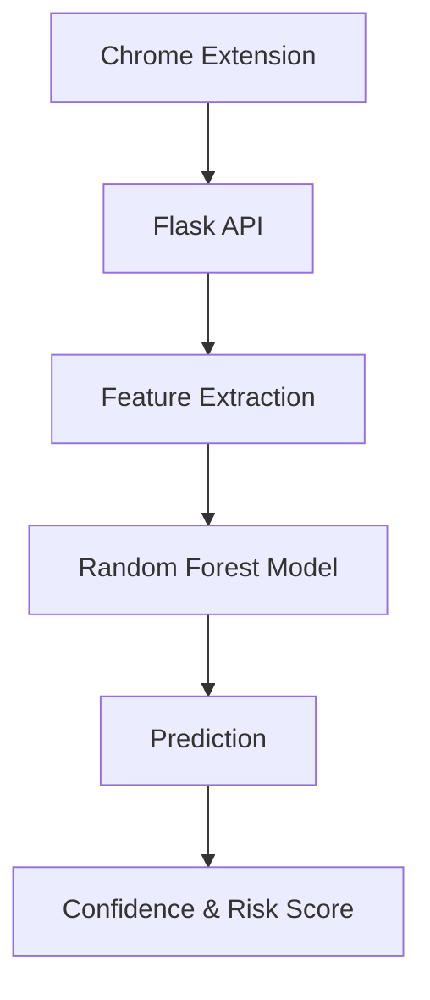

# 🛡️ PhishShield-AI

An AI-powered phishing website detection system that analyzes URLs using Machine Learning and provides real-time protection through a Chrome Extension.

## 🌐 Live Demo

https://phishshield-ai-psjv.onrender.com

---

## ✨ Features

<<<<<<< HEAD
## 🌐 Live Demo

🚀 Try the live application here:

👉 **[Launch PhishShield-AI](https://phishshield-ai-psjv.onrender.com)**
Python

Flask

Scikit Learn

Machine Learning

Chrome Extension

MIT License

Render


## 🚀 Features

- 🔍 Detects phishing websites using Machine Learning
- 🤖 Random Forest Classification Model
- 🌐 Flask REST API
- 🧩 Chrome Extension for real-time detection
- 📊 Displays confidence score
- ⚡ Fast predictions
- 🎨 Modern responsive UI
- 📄 Download scan reports
=======
- 🔍 Real-time phishing detection
- 🤖 Machine Learning (Random Forest)
- 🌐 Chrome Extension
- 📊 Confidence Score
- ⚠️ Risk Level Detection
- 🚀 Flask REST API
- ☁️ Live Deployment on Render
>>>>>>> 8a65028 (Make live demo link clickable)

---
Architecture Diagram
## 🏗️ Architecture




Model Performance
## 📊 Model Performance

| Metric | Value |
|--------|-------|
| Accuracy | **94.8%** |
| Algorithm | Random Forest |
| Features | 25+ |
| Prediction Time | < 1 second |

Sample API Response
{
  "url":"https://google.com"
}
{
  "prediction":"SAFE",
  "confidence":"98%",
  "risk":"Low"
}

---

### 5. Live Demo clickable

Instead of plain URL:

```md
## 🌐 Live Demo

🔗 **https://phishshield-ai-psjv.onrender.com**
## 🛠️ Tech Stack

- Python
- Flask
- Scikit-learn
- Random Forest
- HTML
- CSS
- JavaScript
- Chrome Extension
- Render

---

## 📂 Project Structure

```
PhishShield-AI/
│
├── backend/
│   ├── app.py
│   ├── model/
│   ├── features.py
│   └── requirements.txt
│
├── extension/
│   ├── manifest.json
│   ├── popup.html
│   ├── popup.js
│   └── style.css
│
├── screenshots/
└── README.md
```

---

## 🚀 Installation

```bash
git clone https://github.com/ramcharanbellamkonda/PhishShield-AI.git
cd PhishShield-AI/backend
pip install -r requirements.txt
python app.py
```

---

<<<<<<< HEAD
## 🌍 API Endpoint

POST

```
/predict
```

Example

```json
{
    "url":"https://google.com"
}
```

---

## 📈 Future Improvements

- Domain Age Verification
- SSL Certificate Analysis
- WHOIS Integration
- QR Code Phishing Detection
- Deep Learning Model
- Dashboard Analytics

---

## 👨‍💻 Author

**Ramcharan Bellamkonda**

GitHub: https://github.com/ramcharanbellamkonda

---

## ⭐ Support

If you like this project, consider giving it a ⭐ on GitHub.


=======
>>>>>>> 8a65028 (Make live demo link clickable)
## 📸 Screenshots

### 🏠 Home Page


### ✅ Safe Website Detection


### ⚠️ Phishing Detection


### 🧩 Chrome Extension


### 📄 Scan Report


## 🤖 Machine Learning

Model Used:

- Random Forest Classifier

Dataset:

- Phishing URLs
- Legitimate URLs

Prediction Output:

- Safe
- Phishing

Confidence Score

Risk Level

---

## 👨‍💻 Author

Ramcharan Bellamkonda

GitHub:
https://github.com/ramcharanbellamkonda

---

## 📜 License

MIT License


